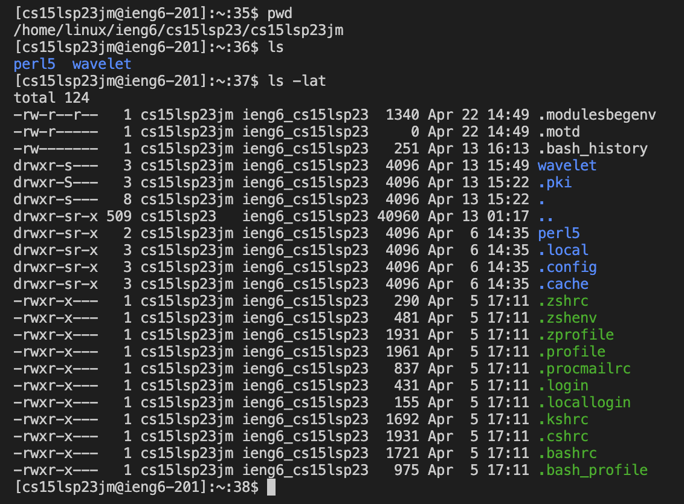
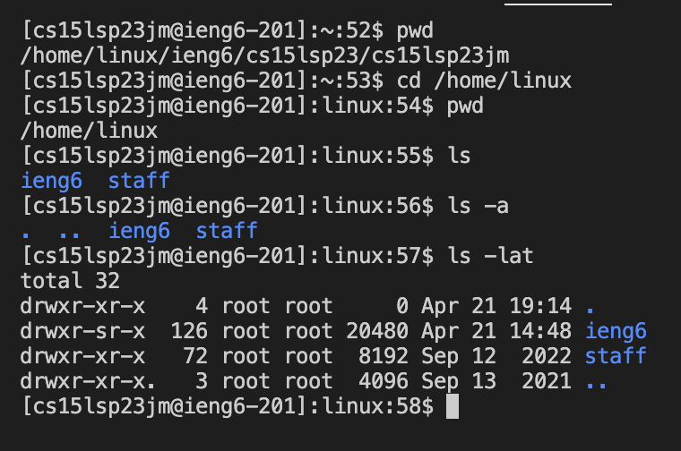
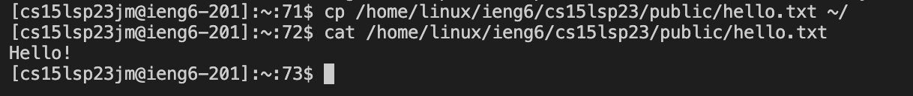

# Remote Access 
---

In this post I will be showing you how I installed [Visual Studio Code](https://code.visualstudio.com/) then how I remotely connected using Visual Studio Code, then finally showing some commands to use in the terminal.
## Getting Your CSE15L Account

I got my CSE15L account by simply go to this [website](https://sdacs.ucsd.edu/~icc/index.php) and filled in my username and PID.
To reset my password I followed the links that told me to reset my password once I was in the website.


## Installing Visual Studio Code
First I went to the [Visual Studio Code](https://code.visualstudio.com/) website.
> If the link doesn't, copy and paste this into your browser: https://code.visualstudio.com/


I clicked on the download button to download. If you want to select your operating system, click on the arrow down to reveal more downloads for differen't systems.


After I have installed it and open it, its all set!

## Remotely Connecting

To remotely connect, I would first need to have Visual Studio Code open.
Then I would open up the terminal.

> Install [git](https://git-scm.com/) if your operating system is Windows 

> For my MacOS it would look like this:
> 

I clicked on the terminal and select new terminal.

With my terminal opened up I would then need to type:
`$ ssh cs15lsp23xx@ieng6.ucsd.edu`
Replacing the x's with the corresponding letters in your username. Then type in `yes` as an answer to the question that pops up. Then you would enter your password that you resetted, 


**Its done!**

## Commands

Now I can try some commands in the terminal!
```
Some key commands are:
ls
pwd
cd
```
cd (path goes here)  | Changes the working directory 
pwd                  | Displays the current working directory 
ls (path goes here)  | Can show me the files and folders in the given path determined by the directory 

3 More commands I tried in lab were the following:
```
ls -lat & ls -a
```



The ls part of the command lists the files and folders in the given path. However the -a and -lat part of the command allows me to see different files
`-a` Alows ls to show the files including the hidden ones
`-lat` Alows ls to show the hidden files, as well as additional information about the files such as the date, owner, group, size, and permissions.
I also had pwd to tell me what my current directory was so I don't get lost.

Another command I tried is 
`cp /home/linux/ieng6/cs15lsp23/public/hello.txt ~/`
cp allowed me to copy a file from the directory and the ~/ at the end is referring to my home directory. So what this command is doing is copying the hello.txt file from the /home/linux/ieng6/cs15lsp23/public directory to my home directory.

This then allowed me to use the command `cat /home/linux/ieng6/cs15lsp23/public/hello.txt` to display the hello.txt file in my terminal.


