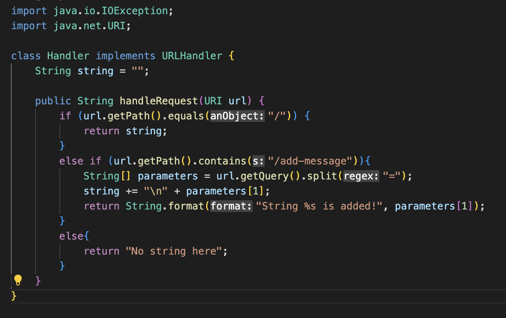
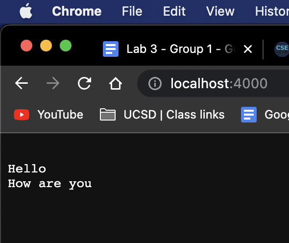
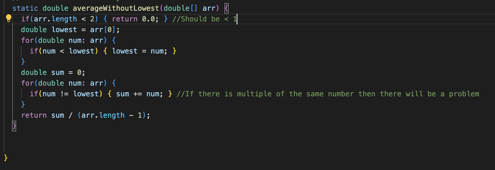
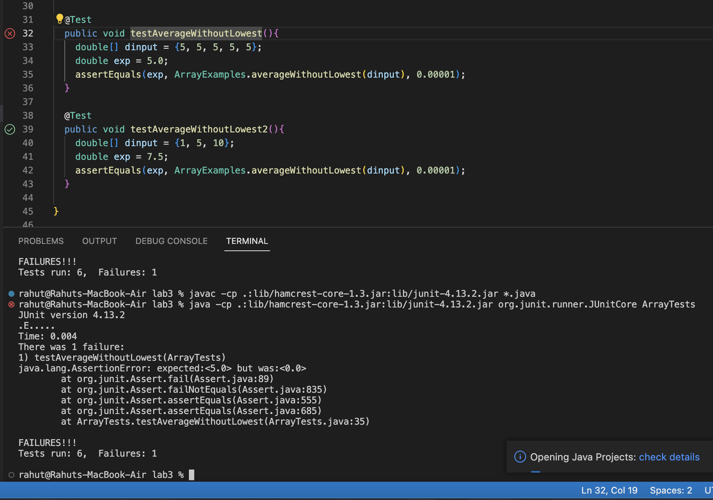

# Lab Report 2
---

This is my code for my String Server.



---
This is me using `/add-message?s=Hello` and this calls to the function `if (url.getPath().contains("/add-message"))` then it returns with the message `String.format("String %s is added!", parameters[1]);` which is "String Hello is added!. This serves as a indicator that adding the string was successful. However before that is printed out, it calls to the method in the handle request. The URL goes through each if statement and in this case it splits the URL into two by "=" and store it in the array `parameters` . So then it takes the second argument and adds it into the `string` variable. Therefore when you return to the `http://localhost:4000/` it display the string variable which has "Hello" added to it.


---
This picture shows me using `/add-message?s=How are you` and this is basically showing the same message as before. It runs through the same methods as before however now the `String string = ""` variable is not blank anymore. Since we added the Hello beforehand the current `string` variable would countain `Hello`. The "\n" in the string += line makes it so that whatever string is added, it is added on to the next line. So for each request of /add-message, the string variable would be changed/updated.




## Bugs
---

So from lab 3 I decided to choose a bug with the averageWithoutLowest method. (See Below)



**Input**

The input I believed will cause the program to fail is {5, 5, 5, 5, 5} or any list of the same number. I had the JUNIT test to test my theory below:
```
@Test
public void testAverageWithoutLowest(){
   double[] dinput = {5, 5, 5, 5, 5};
   double exp = 5;
   assertEquals(exp, ArrayExamples.averageWithoutLowest(dinput), 0.00001);
 }
```

The input that I believe wont induce a failure is any array without a repeated "lowest number" like the one shown below:
```
@Test
public void testAverageWithoutLowest2(){
    double[] dinput = {1, 5, 10};
    double exp = 7.5;
    assertEquals(exp, ArrayExamples.averageWithoutLowest(dinput), 0.00001);
  }
```


**Symptom**

After running the JUNIT test the result is seen below:




**Before**

```
  static double averageWithoutLowest(double[] arr) {
    if(arr.length < 2) { return 0.0; } 
    double lowest = arr[0];
    for(double num: arr) {
      if(num < lowest) { lowest = num; }
    }
    double sum = 0;
    for(double num: arr) {
      if(num != lowest) { sum += num; } 
    }
    return sum / (arr.length - 1);
  }
```

**After fixes**

```
  static double averageWithoutLowest(double[] arr) {
    if(arr.length < 1) { return 0.0; } 
    double lowest = arr[0];
    int indx = 0;
    for(int i = 0; i < arr.length; i++) {
      if(arr[i] < lowest) { 
        lowest = arr[i];
        indx = i; 
      }
    }
    double sum = 0;
    for(int i = 0; i < arr.length; i++){
      if(i != indx){
        sum += arr[i];
      }
      
    }
    return sum / (arr.length - 1);
  }
```
I first fixed the issue of if the array length was 1 or no elements in the arry it would just return 0. It first had arr.length<2 in the if statement which was wrong because it would return 0 even if there is 2 elements in the array which is not what we wanted. I then addressed the issue of the line `if(num != lowest) { sum += num; }`. This line was a problem because it was comparing if the number value was equal to each other. So when its going through the array it wont add the number to the sum because its comparing the same number with each other over and over. So I addressed this issue by instead of comparing each number with the lowest, I compared the index of the numbers instead. Therefore the lowest number would be stored as an index value. So when the for loop is looping through each element, if it gets to the array of lowest number it'll skip over it and wont add that number at that index into the sum. Fixing the issue.
