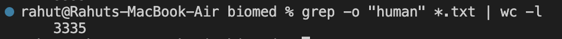
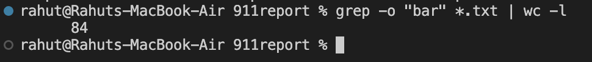
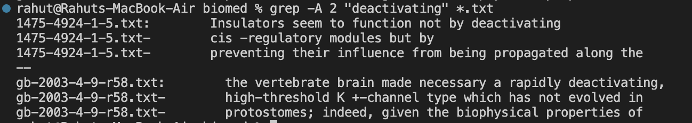
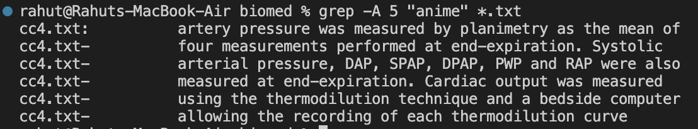
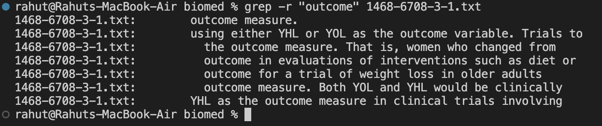
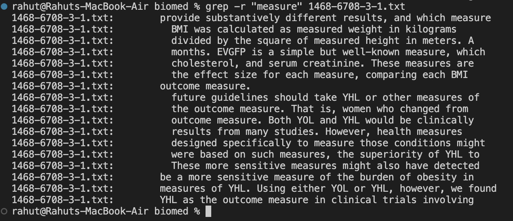
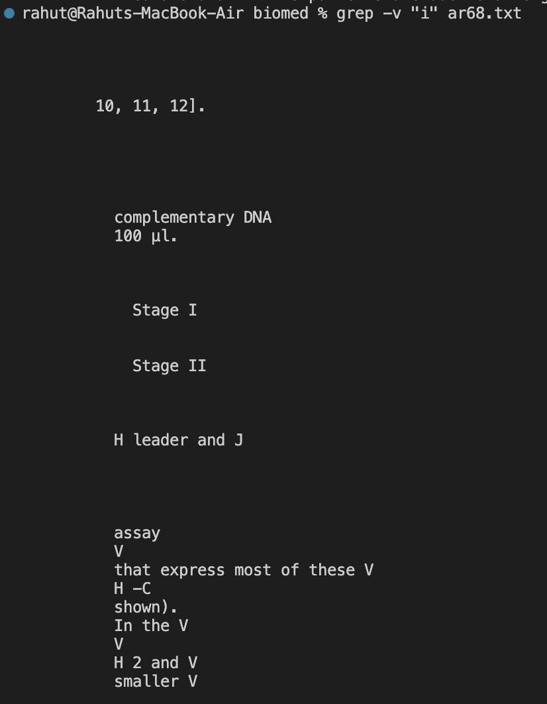
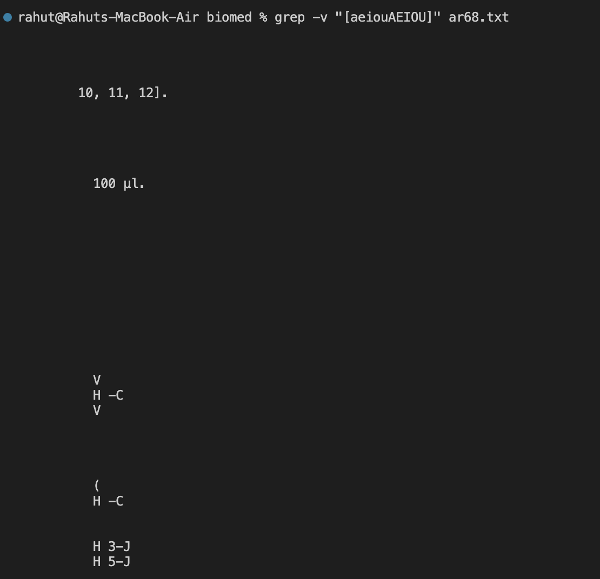

# Lab Report 3
---

In this lab report, I am writing about the command `grep` in bash. Below are 4 interesting command-line options for the `grep` command.

---

The first command I am showcasing is `grep -o "search term" *.txt | wc -l`. 

In this example below my current directory is `/Users/rahut/Documents/GitHub/docsearch/technical/biomed`. This command searches for the inputed "search term" and it counts the search term words in the file directory. Using `grep -o`, `grep` searches the given files for lines that match the search query, the `-o` makes it so grep prints out each occurence of the search term instead of the whole line. The pipe `|` character acts like `>` symbol in bash but instead it uses the grep output as an input for the `wc` command. `wc -l` Is used to count the lines of the grep output. This is useful to find how many instance of the word each lines contains.



This next example shows me using it to find how many occurences each lines contains the word "bar" in txts files in the 911 report directory.



Credit: To find these commands I used ChatGPT with the following series of prompts:
I first started off by saying:
`what do the commands less, find, and grep do in bash`


Then it listed each one of the command and their functionality. Which is when I chosed to write this report about grep.
Then I entered: `Can you tell me all the useful grep syntaxes and their functions with examples`


It showed me some cool ones but I didn't feel like it was interesting so then I entered the prompt:
`What are some interesting ways to use the grep command in a directory full of txt files`


Which led me to find the command:
`grep -o "search term" *.txt | wc -l`


The command was listed along 3 others. I chose this one because I haven't seen it before.
To further understand about it I then asked it:

`In the third option, what is the | for`

`I ran the third command and only got a number what does that mean`

`if my current directory is in a txt file would i still need *.txt`

`what does wc -1 do`

---

The second command I am showcasing is `grep -A # "word" FILE`. The -A in the command is used to specify how many lines to print after the line containing "word". This can be adjusted by changing the #. This can be useful by to get a brief description, or a lines of code that contains an error. It can also be used to see what lines of the word have after the Below are two examples on me using the command. Both with varying #s.





---

The third command I am showcasing is `grep -r "word" FILE`. This is similiar to the first command but now instead counting the words in a line, it showcases the line that the word is contained in. This can be useful if you want to find a line that contains that word and in which file it is in. You can use * instead of a specific file to print out all the lines that containst that word in the directory. It'll show you the line as well as the txt file.





---

The fourth and last command I am showcasing is `grep -v "word" FILE`. This command shows all the lines that doesn't contain the given "word" in a given file. `-v` basically inverts the match, therefore showcasing lines that don't match with the "word". This is useful if you want to find all the lines that doesn't contain a give "word". 



This example below utilizes `[ ]` meaning any character inside will be counted as indiviual characters rather than one word.



You may notice there is alot of blank lines and that is because, if there is blank/empty spaces in the file, the command grep will not exclude them. Grep will treat them as matching the expression pattern. So therefore grep will include them as part of the output. In the examples above, grep excluded vowels so therefore the blank lines are printed as they have no vowel. I also asked ChatGPT this prompt: 
```
so how come when I use 
grep -v "i" text.txt

it had a bunch of blank spaces in the output
```

It responded by explaining becasue the prescence of the empty lines in the text files. Grep processes them as matching lines that doesn't contain the letter "i" therefore printing it out in the output. Furthermore, it also said to use the command `grep -v "i" text.txt | grep -v "^$"` it explains how this command applies additional grep commands using `^` to indicate the start of the line and `$` denoting the end of the line which essentially gets rid of the blank space in the output.


