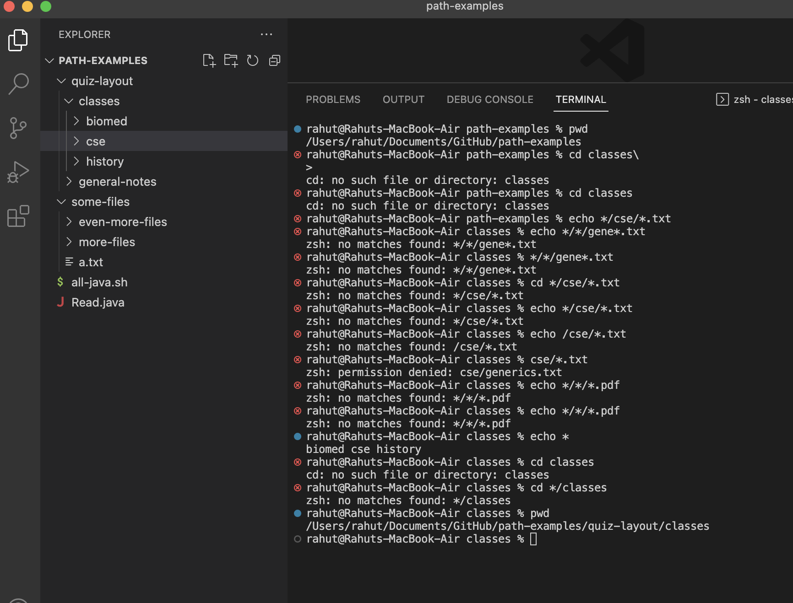

# Lab Report 3
---

In this lab report, I am writing about the command `grep` in bash. Below are 4 interesting command-line options for the `grep` command.

---

The first command I am showcasing is `grep -o "search term" *.txt | wc -l`. 

In this example below my current directory is `/Users/rahut/Documents/GitHub/docsearch/technical/biomed`. This command searches for the inputed "search term" and it counts the search term words in the file directory. Using `grep -o`, `grep` searches the given files for lines that match the search query, the `-o` makes it so grep prints out each occurence of the search term instead of the whole line. The pipe `|` character acts like `>` symbol in bash but instead it uses the grep output as an input for the `wc` command. `wc -l` Is used to count the lines of the grep output. This is useful to find how many instance of the word each lines contains.

This next example shows me using it to find how many occurences each lines contains the word "bar" in txts files in the 911 report directory.

---

The second command I am showcasing is ``.

